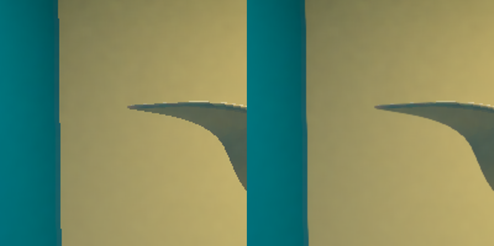

本文介绍代码中的相关算法和实现

# 相机

相机为针孔相机。

已知，在世界空间中，以归一化的向量 $\mathbf{forward}$ 、 $\mathbf{up}$ 和 $\mathbf{right}$ 分别定义了相机的前方、上方和右方。相机的位置为 $\mathbf{o}$ ，纵向视场角为大小为 $fovy$ ，胶片的宽高比为 $aspect$ ，宽度为 $w$ 。成像分辨率为 $W\times H$ 。

胶片的高为 $h$ ，

$$
h=\frac{w}{aspect}
$$

相机的像距为

$$
d=\frac{h}{2\tan{\frac{fovy}{2}}}
$$

一个像素的高度为 $m=\frac{h}{H}$ ，宽度为 $n=\frac{w}{W}$ 。

图像的左上角的位置为

$$
\mathbf{s}=\mathbf{o}+\left(-\frac{w}{2}\mathbf{right}+\frac{h}{2}\mathbf{up}+d\mathbf{forward}\right)
$$

则图像左上角的像素中心的位置为

$$
\mathbf{s}-\frac{m}{2}\mathbf{up}+\frac{n}{2}\mathbf{right}
$$

以此类推，位于从左往右数第i列，从上往下数第j行的像素的位置为

$$
\mathbf{p}_{i,j}=\mathbf{s}-\frac{(2j+1)m}{2}\mathbf{up}+\frac{(2i+1)n}{2}\mathbf{right}
$$

注意，其中i和j都是从0开始数。然后可知，从相机位置指向该像素的位置的向量为

$$
\mathbf r=\mathbf{p}_{i,j}-\mathbf{o}\\
=d \mathbf{forward}+(\frac{h}{2}-\frac{(2j+1)m}{2})\mathbf{up}+(\frac{(2i+1)n}{2}-\frac{w}{2})\mathbf{right}\\
=\frac{h}{2}\left(\frac{1}{\tan{\frac{fovy}{2}}}\mathbf{forward}+\frac{H-2j-1}{H}\mathbf{up}+\frac{(2i+1-W)aspect}{W}\mathbf{right}\right)
$$

则发射光线的传播方向为

$$
\mathbf d=\frac{\mathbf r}{|\mathbf{r}|}
$$

# 求交

## 光线和三角形

光线为 $\mathbf{o}+t\mathbf{d}$，其中 $\mathbf{o}$ 为光的发射点， $\mathbf{d}$ 为光的传播方向。

三角形的三点分别为A、B和C，向量 $\mathbf{a}=\mathbf{CB}$ ， $\mathbf{b}=\mathbf{CA}$ 。三角形内任意一点可 $\mathbf{p}$ 由以下式子表示。

$$
\mathbf{p}=\mathbf{C}+\alpha \mathbf{a}+\beta\mathbf{b}
$$

$$
\alpha >0, \beta>0, \alpha+\beta<1
$$

求三角形与光线是否相交以及交点，只需解方程

$$
\mathbf{o}+t\mathbf{d}=\mathbf{C}+\alpha \mathbf{a}+\beta\mathbf{b}
$$

$$
\alpha >0, \beta>0, \alpha+\beta<1, t>0
$$

假设 $\mathbf a=(a_x,a_y,a_z)$ ， $\mathbf{b}=(b_x,b_y,b_z)$ ， $\mathbf{t}=(t_x,t_y,t_z)$ ， $\mathbf{o}=(o_x,o_y,o_z)$ ， $\mathbf{C}=(c_x,c_y,c_z)$ ，则有方程

$$
\left[
\begin{matrix}
a_x&b_x&d_x \\
a_y&b_y&d_y \\
a_z&b_z&d_z
\end{matrix}
\right]
\begin{bmatrix}
\alpha \\
\beta \\
-t
\end{bmatrix}
=\begin{bmatrix}
o_x - c_x \\
o_y - c_y \\
o_z - c_z
\end{bmatrix}
$$

Cramer's Law可解上式。

## 光线与轴对齐包围盒
包围盒由6个平面所围成，这6个平面为 $X_1$ ， $X_2$ ， $Y_1$ ， $Y_2$ ， $Z_1$ ， $Z_2$ ，其中， $X_1$ 和 $X_2$ 平行， $Y_1$ 和 $Y_2$ 平行， $Z_1$ 和 $Z_2$ 平行。光线为 $\mathbf{o}+t\mathbf{d}$ 。

当光线和这3对平面都相交时，交点的参数 $t$ 依次分别为 $t_x^1$ 、 $t_x^2$ 、 $t_y^1$ 、 $t_y^2$ 、 $t_z^1$ 、 $t_z^2$ 。如果光线与包围盒相交，那么必然存在参数 $t$ 满足以下条件。

$$
t\in (t_x^1,t_x^2),t\in (t_y^1,t_y^2),t\in (t_z^1,t_z^2),t\in(0,+\infty)
$$

也就是说， $(t_x^1,t_x^2)$ 、 $(t_y^1,t_y^2)$ 、 $(t_z^1,t_z^2)$ 和 $(0,+\infty)$ 有交集。

当光线只与2对或1对平面相交时，这种情况是上述情况的退化，不言自明。

因此只需要 $\cos\theta$ 和 $\varphi$ 分别是均匀分布即可。

# 渲染方程
## Radiant flux 辐射通量
单位时间内通过某一截面的辐射能量，也可以说是通过某一表面的辐射功率，单位是瓦特（ $W$ ）。

$$
\Phi=\frac{\mathrm{d}Q}{\mathrm{d}t}
$$

## Radiant flux density 辐射通量密度
单位面积上的辐射功率，单位是瓦特每平方米（ $W \cdot m^{-2}$ ）。

$$
E=\frac{\mathrm{d}\Phi}{\mathrm{d}A}
$$

## Radiance 辐射率
单位立体角上的辐射通量密度，单位是 $W\cdot m^{-2}\cdot sr^{-1}$ 。

$$
L=\frac{\mathrm{d}E}{\mathrm{d}\omega}
=\frac{\mathrm{d}\Phi}{\mathrm{d}A\mathrm{d}\omega}
$$

## BRDF 双向反射分布函数
BRDF的全称是Bi-directional Reflection Distribution Function，它被定义为沿出射光方向 $\omega_o$ 出射的辐射率 $L$ ，与沿入射光方向 $\omega_i$ 入射的辐照度 $E$ 的比值，单位为 $sr^{-1}$ 。由上述表述，则在物体表面某处的BRDF的定义式即为

$$
f_r(\omega_i\rightarrow\omega_o)=\frac{\mathrm{d}L(\omega_o)}{\mathrm{d}E(\omega_i)}
$$

## 渲染方程的推导
由BRDF的定义可得

$$
\mathrm{d}L(\omega_o)=f_r(\omega_i\rightarrow\omega_o)\mathrm{d}E(\omega_i)
$$

因此

$$
L(\omega_o)=\int{\mathrm{d}L(\omega_o)}
=\int{f_r(\omega_i\rightarrow\omega_o)\mathrm{d}E(\omega_i)}
$$

又因为这里的 $\mathrm{d}E$ 是垂直于表面的，所以

$$
\mathrm{d}E(\omega_i)=L(\omega_i)\mathrm{d}\omega_i\cos{\theta}
$$

其中 $\theta$ 是入射角。因此

$$
L(\omega_o)=\int{\mathrm{d}L(\omega_o)}
=\int{f_r(\omega_i\rightarrow\omega_o)L(\omega_i)\cos{\theta}\mathrm{d}\omega_i}
$$

# 俄罗斯轮盘赌博的数学期望

设每一回合的死亡概率为 $p$，并且 $p\neq 0$ 且 $p \neq 1$，那么发生死亡的回合数符合概率分布 $X$ ， $P(X=i)=p(1-p)^{i-1}$ 。也就是说，死于第 $i$ 回合的概率为 $p(1-p)^{i-1}$。

设

$$
S_n=\sum_{i=1}^{n}{i(1-p)^{i-1}p}
$$

那么

$$
E(X)=\lim_{n\rightarrow+\infty}{S_n}
$$

使用错位相减法，因为

$$
S_n=p+2(1-p)p+3(1-p)^{2}p+...+n(1-p)^{n-1}p
$$

$$
(1-p)S_n=(1-p)p+2(1-p)^{2}p+3(1-p)^{3}p+...+n(1-p)^{n}p
$$

所以,两式相减，得

$$
pS_n
=p+(1-p)p+(1-p)^{2}p+...+(1-p)^{n-1}p-n(1-p)^{n}p
=p\left(\sum_{i=1}^{n}{(1-p)^{i-1}}\right)-n(1-p)^{n}p
$$

$$
S_n
=\left(\sum_{i=1}^{n}{(1-p)^{i-1}}\right)-n(1-p)^{n}
=\frac{1-(1-p)^n}{p}-n(1-p)^n
$$

所以

$$
E(X)
=\lim_{n\rightarrow+\infty}{\left[\frac{1-(1-p)^n}{p}-n(1-p)^n\right]}
=\frac{1}{p}
$$

# 重要性采样

## 余弦权重重要性采样

在半球面上，有

$$
\int_{HemiSphere}\frac{\cos\theta}{\pi}\,\mathrm dA=1
$$

因此，我们采用此 PDF ，即

$$
PDF(\omega)=\frac{\cos\theta}{\pi}
$$

因 $\mathrm d\omega=\sin\theta\,\mathrm d\theta\,\mathrm d\phi$ ，所以

$$
PDF(\theta,\phi)=\frac{\cos\theta\sin\theta}{\pi}
$$

则边缘概率密度

$$
PDF(\theta) = \int_0^{2\pi}\frac{\cos\theta\sin\theta}{\pi}\,\mathrm d\phi=\sin{2\theta}
$$

$$
PDF(\phi)=\int_0^{\frac{\pi}{2}}\frac{\cos\theta\sin\theta}{\pi}\,\mathrm d\theta=\frac{1}{2\pi}
$$

则边缘累积概率分布

$$
CDF(\theta)=\int_0^\theta PDF(\theta)\,\mathrm d\theta=\frac{1-\cos{2\theta}}{2}
$$

$$
CDF(\phi)=\int_0^\theta PDF(\phi)\,\mathrm d\theta=\frac{\phi}{2\pi}
$$

则

$$
\theta=\frac{\arccos(1-2\xi_1)}{2}
$$

$$
\phi=2\pi\xi_2
$$

## GGX重要性采样

GGX法线分布为

$$
D(\mathbf h)=\frac{\alpha^2}{\pi((\mathbf n\cdot\mathbf h)^2(\alpha^2-1)+1)^2}
$$

其中， $\alpha$ 为粗糙度， $\mathbf n$ 为宏观法线。

法线分布函数必满足以下性质

$$
\int D(\mathbf h)(\mathbf n\cdot\mathbf h)\,\mathrm d \mathbf h=1
$$

因此，我们选择采样微观法线的方向，其概率密度函数为

$$
PDF_h(\omega)=D(\omega)(\omega\cdot\mathbf n)=\frac{\alpha^2}{\pi(\cos^2\theta(\alpha^2-1)+1)^2}\cos\theta
$$

其中， $\theta$ 为 $\omega$ 和 $\mathbf n$ 的夹角。

边缘概率密度函数

$$
PDF_h(\theta)=\frac{2\alpha^2}{(\cos^2\theta(\alpha^2-1)+1)^2}\cos\theta\sin\theta
$$

$$
PDF_h(\phi)=\frac{1}{2\pi}
$$

最终

$$
\theta=\arccos\sqrt{\frac{1-\xi_1}{1+\xi_1(\alpha^2-1)}}
$$

$$
\phi=\frac{\phi}{2\pi}
$$

采样得到微观法线 $\mathbf h$ ，根据微观法线 $\mathbf h$ 和出射方向 $\mathbf o$ ，可得入射方向

$$
\mathbf i = 2(\mathbf o\cdot\mathbf h)\mathbf h-\mathbf o
$$

相应地，需要得知此入射方向的概率密度 $PDF_i(\mathbf i)$ 。据外部资料可知

$$
PDF_h=PDF_i\left\Vert \frac{\partial\mathbf h}{\partial\mathbf i} \right\Vert
$$

推导可得，

$$
\left\Vert \frac{\partial\mathbf h}{\partial\mathbf i} \right\Vert=\frac{1}{4(\mathbf i\cdot\mathbf h)}
$$

# FXAA

